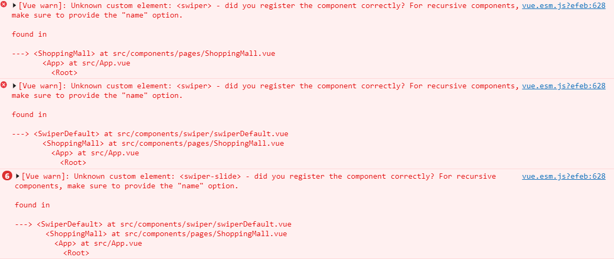

## 01 节 vue-cli 初始化项目命令`vue init webpack`报错

### 原因

- `vue init webpack`为 vue-cli2.x 的初始化项目命令
- 教程发布时 vue-cli 默认版本为 2,`npm i -g vue-cli`默认安装的是 vue-cli2 版本
- 现在 vue-cli 默认版本为 3,`npm i -g vue-cli`默认安装的是 vue-cli3 版本
- vue-cli3.x 初始化命令为`vue create 项目名`

### 解决

用`npm install -g @vue/cli-init`可以按照 vue-cli2 版本的 vue-cli,然后再`vue init webpack`

## 06 节首页轮播图设置懒加载后第一次显示高度异常

### 原因

```
属性width height
定义：在页面加载时为图像预留空间，以免图片加载时，页面布局会发生变化。
css上设置的权限高于直接在img上面设置。
固有尺寸：img图片的自身大小，如果html尺寸不设置，并且Css尺寸不设置，则展现资源图片的固有宽高。
html尺寸：通过html设置height，width属性，且没有Css限制，则展现为html尺寸。
Css尺寸：通过Css属性设置宽高，展现为Css属性设置的结果。
```

因为设置了图片懒加载,所以图片的 src 刚开始没有值,全靠 width 属性来给图片预留位置,img 上的 width="100%"使得给图片的预留空间过大

### 解决

给图片设置 css 的 width 来覆盖 img 上的 width

设置 12rem 是因为根原生的 font-size 为 document.documentElement.clientWidth/20,20rem 刚好相当于屏幕宽度,12rem 相当于屏幕宽度的 0.6

```
  .swiper-area img{
      height: 12rem;
  }
```


## 07 节教程给的 mock 地址失效

1. 在项目跟目录下新建一个文件夹 mock
2. 在里边新建一个 app.js
3. 然后把模拟数据复制到和 app.js 在同级目录下的 data.json 文件中
4. 打开 cmd 进入 mock 文件夹下执行`node app.js`或在项目跟目录下打开 cmd 执行`npm run mock`

```
const http = require('http')
const fs = require('fs')
const path = require('path')
const server = http.createServer(function (req, res) {
  res.setHeader('Access-Control-Allow-Origin', '*') // 允许跨域
  res.setHeader('Content-type', 'application/json;charset=utf-8') // 设置utf-8编码防止出现乱码
  const data = JSON.parse(fs.readFileSync(path.join(__dirname, 'data.json')))
  res.end(JSON.stringify(data))
})
server.listen(2233)
console.log('server is running in port:2233')

```

## 08 节商品分类栏的图标大小不一样


### 原因

```
属性width height
定义：在页面加载时为图像预留空间，以免图片加载时，页面布局会发生变化。
css上设置的权限高于直接在img上面设置。
固有尺寸：img图片的自身大小，如果html尺寸不设置，并且Css尺寸不设置，则展现资源图片的固有宽高。
html尺寸：通过html设置height，width属性，且没有Css限制，则展现为html尺寸。
Css尺寸：通过Css属性设置宽高，展现为Css属性设置的结果。
```

由于第一张图片的原本大小比后边四张的小,直接都在 img 设置`width="90%"`会导致第一张图片的预留空间比其他几个图片小,就会出现上图的效果

### 解决

在当前 vue 组件的 css 代码中加上

```
.type-bar img{
      width: 3rem;
  }
```

去掉 img 上的 width 属性(也可以不用去,因为<b>\_css 上设置的权限高于直接在 img 上面设置</b>。)

```
<div class="type-bar">
    <div v-for="(cate,index) in category" :key="index" >
             <!--这里去掉了width="90%"-->
            <span>{{cate.mallCategoryName}}</span>
    </div>
</div>
```

## 09 节`npm install vue-awesome-swiper --save`安装报错

报错如下

```
npm ERR! code ENOENT
npm ERR! errno -4058
npm ERR! syscall access
npm ERR! enoent ENOENT: no such file or directory, access '...\node_modules\.'
npm ERR! enoent This is related to npm not being able to find a file.
npm ERR! enoent

npm ERR! A complete log of this run can be found in:
npm ERR!     ...-debug.log
```

删除掉 `C:\Users\xxx\AppData\Roaming\npm-cache\`,```C:\Users\xxx\AppData\Roaming\npm\` 两个文件夹

### `import 'swiper/css/swiper.css'`报错


问题出在`import 'swiper/css/swiper.css'`这句话上
应该替换为`import 'swiper/swiper-bundle.css'`
在 Swiper 的 Github 上有所提及原因，是 Swiper 的版本问题
Swiper6 和 6 以上的版本用`import 'swiper/swiper-bundle.css'`


### 使用 swiper 组件报错


出错原因,组件名首字母没大写
vue 中注册组件组件名称应该大写
如

```
components: {SwiperSlide}
<swiper-slide></swiper-slide>
```

### 使用 swiper6 分页器不出现

原因在于，在第六版导入只能导入 swiper 核心内容，而部分组件效果如分页器需要单独导入
main.js 中加上

```
import Swiper, { Pagination, Navigation } from 'swiper'
Swiper.use([Pagination, Navigation])
```

## 19 节启动 mongodb 数据库

分别执行以下命令(其中`D:\mongodb-win32-x86_64-2008plus-ssl-4.0.3`替换成 mongob 所在的路径)

```
d:
cd D:\mongodb-win32-x86_64-2008plus-ssl-4.0.3\bin
mongod -dbpath D:\mongodb-win32-x86_64-2008plus-ssl-4.0.3\db
```

也可以把上述命令保存在一个 txt 文件中,然后把后缀名改成 bat,每次点击的 bat 文件即可
